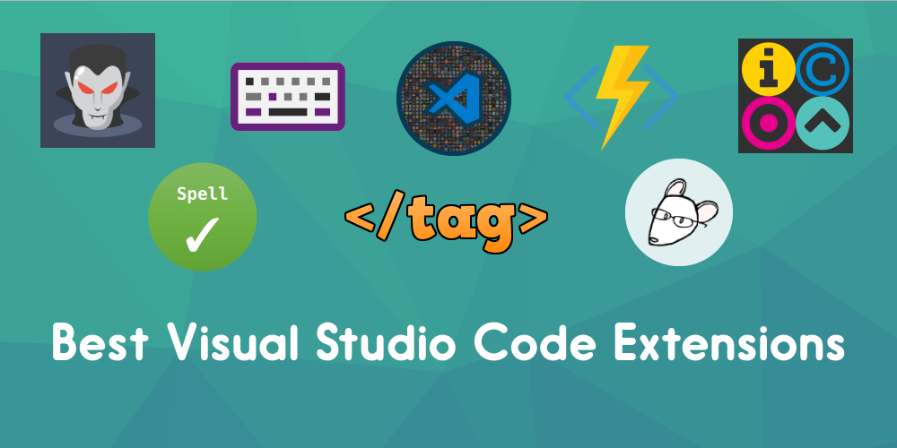

Usefull for JavaScript Developers
------

Note : List is in Random Order

* Use <kbd>Ctrl</kbd> + <kbd>F</kbd> or <kbd>command</kbd> + <kbd>F</kbd> to search for a module.
* Contributions are welcome.

## Extensions for development

List of packages needed for development.

* [`Angular 8 Snippets`](https://marketplace.visualstudio.com/items?itemName=Mikael.Angular-BeastCode) - Visual Studio Code TypeScript and Html snippets and code examples for Angular 2,4,5,6, 7 & 8 Beta.
All code snippets are based on and follow the Angular style guide https://angular.io/docs/ts/latest/guide/style-guide.html

* [`Angular Files`](https://marketplace.visualstudio.com/items?itemName=alexiv.vscode-angular2-files) - This extension allows quickly scaffold angular 2 file templates in VS Code project.

* [`Angular Language Service`](https://marketplace.visualstudio.com/items?itemName=Angular.ng-template) - Editor services for Angular templates.
* [`Loopback`](http://loopback.io/) - Node.js framework for creating APIs and easily connecting to backend data sources.

* [`Auto Close Tag`](https://marketplace.visualstudio.com/items?itemName=Mikael.Angular-BeastCode) - Automatically add HTML/XML close tag, same as Visual Studio IDE or Sublime Text does.

* [`Auto Import`](https://marketplace.visualstudio.com/items?itemName=steoates.autoimport) - Automatically finds, parses and provides code actions and code completion for all available imports. Works with Typescript and TSX.

* [`Auto Rename Tag`](https://marketplace.visualstudio.com/items?itemName=formulahendry.auto-rename-tag) - Automatically rename paired HTML/XML tag, same as Visual Studio IDE does.

* [`Beautify`](https://marketplace.visualstudio.com/items?itemName=HookyQR.beautify) - Beautify javascript, JSON, CSS, Sass, and HTML in Visual Studio Code.

* [`Better Comments`](https://marketplace.visualstudio.com/items?itemName=aaron-bond.better-comments) - Improve your code commenting by annotating with alert, informational, TODOs, and more!

* [`Bookmark`](https://marketplace.visualstudio.com/items?itemName=alefragnani.Bookmarks) - Mark lines and jump to them

* [`Change Case`](https://marketplace.visualstudio.com/items?itemName=mostafa.change-case) - Quickly change the case (camelCase, CONSTANT_CASE, snake_case, etc) of the current selection or current word

* [`Code Navigator`](https://marketplace.visualstudio.com/items?itemName=vikas.code-navigation) - Navigate Code Back and Forward very easily

* [`Code Runner`](https://marketplace.visualstudio.com/items?itemName=formulahendry.code-runner) - Run code snippet or code file for multiple languages: C, C++, Java, JavaScript, PHP, Python, Perl, Perl 6, Ruby, Go, Lua, Groovy, PowerShell, BAT/CMD, BASH/SH, F# Script, F# (.NET Core), C# Script, C# (.NET Core), VBScript, TypeScript, CoffeeScript, Scala, Swift, Julia, Crystal, OCaml Script, R, AppleScript, Elixir, Visual Basic .NET, Clojure, Haxe, Objective-C, Rust, Racket, Scheme, AutoHotkey, AutoIt, Kotlin, Dart, Free Pascal, Haskell, Nim, D, Lisp, Kit, and custom command

* [`Code Time`](https://marketplace.visualstudio.com/items?itemName=softwaredotcom.swdc-vscode) - Code Time is an open source plugin that provides programming metrics right in Visual Studio Code.

* [`Code Highlight`](https://marketplace.visualstudio.com/items?itemName=naumovs.color-highlight) - Highlight web colors in your editor.

* [`Cypher Query Language`](https://marketplace.visualstudio.com/items?itemName=jakeboone02.cypher-query-language) - Syntax highlighting for Neo4j's Cypher Query Language

* [`Debugger for Chrome`](https://marketplace.visualstudio.com/items?itemName=msjsdiag.debugger-for-chrome) - Debug your JavaScript code in the Chrome browser, or any other target that supports the Chrome Debugger protocol..

* [`Docker`](https://marketplace.visualstudio.com/items?itemName=ms-azuretools.vscode-docker) - Adds syntax highlighting, commands, hover tips, and linting for Dockerfile and docker-compose files.

* [`DotENV`](https://marketplace.visualstudio.com/items?itemName=mikestead.dotenv) - Support for dotenv file syntax

* [`EditorConfig for VS Code`](https://marketplace.visualstudio.com/items?itemName=EditorConfig.EditorConfig) - EditorConfig Support for Visual Studio Code

* [`ES7 React/Redux/GraphQL/React-Native snippets](https://marketplace.visualstudio.com/items?itemName=dsznajder.es7-react-js-snippets) - Simple extensions for React, Redux and Graphql in JS/TS with ES7 syntax

* [`ESLint`](https://marketplace.visualstudio.com/items?itemName=dbaeumer.vscode-eslint) - Integrates ESLint JavaScript into VS Code.

* [`Excel Viewer`](https://marketplace.visualstudio.com/items?itemName=GrapeCity.gc-excelviewer) - View Excel spreadsheets and CSV files within Visual Studio Code workspaces.

* [`Express Snippets`](https://marketplace.visualstudio.com/items?itemName=vladmrnv.expresssnippet) - Express Snippets for VS Code

* [`File Navigator`](https://marketplace.visualstudio.com/items?itemName=jakelucas.code-file-nav) - A Visual Studio Code extension that allows easy navigation and file/folder manipulation of the filesystem via quick pick palettes.

* [`Git History`](https://marketplace.visualstudio.com/items?itemName=donjayamanne.githistory) - View git log, file history, compare branches or commits

* [`Git Lens`](https://marketplace.visualstudio.com/items?itemName=eamodio.gitlens) - Supercharge the Git capabilities built into Visual Studio Code — Visualize code authorship at a glance via Git blame annotations and code lens, seamlessly navigate and explore Git repositories, gain valuable insights via powerful comparison commands, and so much more

* [`Guides`](https://marketplace.visualstudio.com/items?itemName=spywhere.guides) - An extension for more guide lines

* [`HTML TO Pug`](https://marketplace.visualstudio.com/items?itemName=dbalas.vscode-html2pug) - HTML to PUG VSCode extension

* [`IntelliSense for CSS class names in HTML`](https://marketplace.visualstudio.com/items?itemName=Zignd.html-css-class-completion) - CSS class name completion for the HTML class attribute based on the definitions found in your workspace.

* [`JavaScript (ES6) code snippets`](https://marketplace.visualstudio.com/items?itemName=xabikos.JavaScriptSnippets) - Code snippets for JavaScript in ES6 syntax.

* [`Jest`](https://marketplace.visualstudio.com/items?itemName=Orta.vscode-jest) - Use Facebook's Jest With Pleasure. (Its a Testing Framework)

* [`JSON to TS`](https://marketplace.visualstudio.com/items?itemName=MariusAlchimavicius.json-to-ts) - Convert JSON object to typescript interfaces

* [`LeetCode`](https://marketplace.visualstudio.com/items?itemName=shengchen.vscode-leetcode) - Solve LeetCode problems in VS Code

* [`Live Sass Compiler`](https://marketplace.visualstudio.com/items?itemName=ritwickdey.live-sass) - Compile Sass or Scss to CSS at realtime with live browser reload.

* [`Live Server`](https://marketplace.visualstudio.com/items?itemName=ritwickdey.LiveServer) - Launch a development local Server with live reload feature for static & dynamic pages

* [`markdownlint`](https://marketplace.visualstudio.com/items?itemName=DavidAnson.vscode-markdownlint) - Markdown linting and style checking for Visual Studio Code.

* [`Material Icon Theme`](https://marketplace.visualstudio.com/items?itemName=PKief.material-icon-theme) - Material Design Icons for Visual Studio Code

* [`Move TS - Move TypeScript files and update relative imports`](https://marketplace.visualstudio.com/items?itemName=stringham.move-ts) - extension for moving typescript files and folders and updating relative imports in your workspace

* [`Nest Comments`](https://marketplace.visualstudio.com/items?itemName=philsinatra.nested-comments) - This is a VSCode extension for toggling nested comments.

* [`Node modules resolve`](https://marketplace.visualstudio.com/items?itemName=naumovs.node-modules-resolve) - Provides definitions for commonjs requires in your code for quick navigation.

* [`Node.js Extension Pack`](https://marketplace.visualstudio.com/items?itemName=waderyan.nodejs-extension-pack) - Popular VS Code extensions for Node.js development.

* [`Node.js Modules Intellisense`](https://marketplace.visualstudio.com/items?itemName=leizongmin.node-module-intellisense) - Autocompletes Node.js modules in import statements

* [`npm`](https://marketplace.visualstudio.com/items?itemName=eg2.vscode-npm-script) - npm support for VS Code

* [`npm Intellisense`](https://marketplace.visualstudio.com/items?itemName=christian-kohler.npm-intellisense) - Visual Studio Code plugin that autocompletes npm modules in import statements

* [`One Dark Pro`](https://marketplace.visualstudio.com/items?itemName=zhuangtongfa.Material-theme) - Atom's iconic One Dark theme for Visual Studio Code

* [`Open HTML in Default Browser`](https://marketplace.visualstudio.com/items?itemName=peakchen90.open-html-in-browser) - Open HTML in Default Browser

* [`Paste JSON as Code`](https://marketplace.visualstudio.com/items?itemName=quicktype.quicktype) - Copy JSON, paste as Go, TypeScript, C#, C++ and more.

* [`Path Intellisense`](https://marketplace.visualstudio.com/items?itemName=christian-kohler.path-intellisense) - Visual Studio Code plugin that autocompletes filenames

* [`Project Manager`](https://marketplace.visualstudio.com/items?itemName=alefragnani.project-manager) - Easily switch between projects

* [`Quokka.js`](https://marketplace.visualstudio.com/items?itemName=WallabyJs.quokka-vscode) - Live Scratchpad for JavaScript.

* [`Rainbow Brackets`](https://marketplace.visualstudio.com/items?itemName=2gua.rainbow-brackets) - Provide rainbow colors for the round brackets, the square brackets and the squiggly brackets. This is particularly useful for Lisp or Clojure programmers, and of course, JavaScript, and other programmers.

* [`React Pure To Class`](https://marketplace.visualstudio.com/items?itemName=angryobject.react-pure-to-class-vscode) - Replaces pure functional react components with class components. Works both for JavaScript and TypeScript.

* [`Remote-Containers`](https://marketplace.visualstudio.com/items?itemName=ms-vscode-remote.remote-containers) - Open any folder inside (or mounted into) a container and take advantage of Visual Studio Code's full feature set.

* [`Remote-SSH`](https://marketplace.visualstudio.com/items?itemName=ms-vscode-remote.remote-ssh) - Open any folder on a remote machine using SSH and take advantage of VS Code's full feature set.

* [`Remote - SSH: Editing Configuration Files`](https://marketplace.visualstudio.com/items?itemName=ms-vscode-remote.remote-ssh-edit) - Edit SSH configuration files

* [`Remote-SSH: Explorer`](https://marketplace.visualstudio.com/items?itemName=ms-vscode-remote.remote-ssh-explorer) - Provides an explorer for SSH remotes.

* [`Remote - WSL`](https://marketplace.visualstudio.com/items?itemName=ms-vscode-remote.remote-wsl) - Open any folder in the Windows Subsystem for Linux (WSL) and take advantage of Visual Studio Code's full feature set.

* [`Remote-Developers`](https://marketplace.visualstudio.com/items?itemName=ms-vscode-remote.vscode-remote-extensionpack) - An extension pack that lets you open any folder in a container, on a remote machine, or in WSL and take advantage of VS Code's full feature set.

* [`REST Client`](https://marketplace.visualstudio.com/items?itemName=humao.rest-client) - REST Client allows you to send HTTP request and view the response in Visual Studio Code directly.

* [`Search node_modules`](https://marketplace.visualstudio.com/items?itemName=jasonnutter.search-node-modules) - Quickly search the node_modules folder.

* [`Settings Sync`](https://marketplace.visualstudio.com/items?itemName=Shan.code-settings-sync) - Synchronize Settings, Snippets, Themes, File Icons, Launch, Keybindings, Workspaces and Extensions Across Multiple Machines Using GitHub Gist.

* [`Swagger Viewer`](https://marketplace.visualstudio.com/items?itemName=Arjun.swagger-viewer) - Swagger Viewer lets you preview and validate Swagger 2.0 and OpenAPI files as you type in Visual Studio Code.

* [`TabNine`](https://marketplace.visualstudio.com/items?itemName=TabNine.tabnine-vscode) - All-language autocompleter — TabNine uses machine learning to help you write code faster.

* [`TypeScript Hero`](https://marketplace.visualstudio.com/items?itemName=rbbit.typescript-hero) - STypeScript Hero is a vscode extension that makes your life easier. When you are coding a lot of TypeScript you may want vscode to organize your imports.

* [`Unsaved Files`](https://marketplace.visualstudio.com/items?itemName=wraith13.unsaved-files-vscode) - Easy access to unsaved files for vscode.

* [`Version Lens`](https://marketplace.visualstudio.com/items?itemName=pflannery.vscode-versionlens) - Shows the latest version for each package using code lens

* [`VSCode-Faker`](https://marketplace.visualstudio.com/items?itemName=deerawan.vscode-faker) - Generate fake data for name, address, lorem ipsum, commerce and much more

* [`vscode-styled-components`](https://marketplace.visualstudio.com/items?itemName=jpoissonnier.vscode-styled-components) - Syntax highlighting and IntelliSense for styled-components.